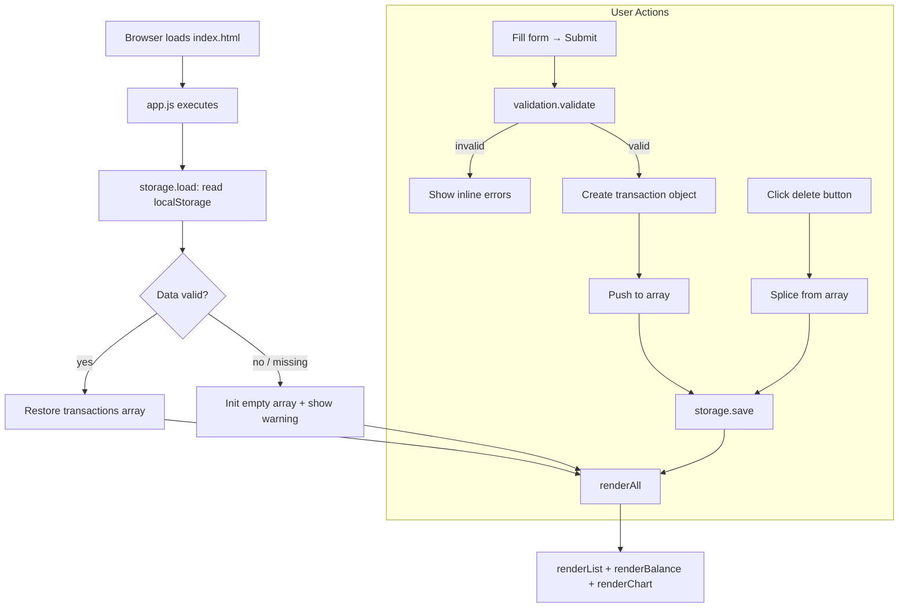

# Design Document — Expense & Budget Visualizer

## Overview

The Expense & Budget Visualizer is a zero-dependency, client-side single-page application (SPA) that lets users record personal expense transactions, review them in a scrollable list, monitor a running total balance, and understand spending distribution through a live pie chart. All data is persisted in the browser's `localStorage` so sessions survive page refreshes and browser restarts.

The entire application is delivered as three static files:

| File | Role |
|---|---|
| `index.html` | Markup, CDN link for Chart.js |
| `css/style.css` | All visual styling |
| `js/app.js` | All application logic |

No build step, no server, no login. The user opens `index.html` and the app is ready.

---

## Architecture

### High-Level Flow



### Architectural Decisions

**Single global state array** — `transactions` is a module-level array in `app.js`. Every mutation (add / delete) is immediately followed by `storage.save()` and `renderAll()`. This keeps the UI always in sync with storage without any diffing or virtual DOM.

**Full re-render on every mutation** — Given the small data set (personal expense tracking, typically < 1 000 entries), clearing and rebuilding the DOM list on each change is simpler and fast enough to stay well under the 100 ms budget.

**Chart.js singleton** — A single `Chart` instance is created on first render and updated via `chart.data` + `chart.update()` on subsequent renders, avoiding repeated canvas teardown.

**No modules** — Per project constraints, `app.js` is a plain `<script>` tag. Functions are grouped by concern using comment blocks and a consistent naming prefix.

---

## Components and Interfaces

### Function Groups in `app.js`

#### Storage Group

```
storage_load()  → Transaction[]
    Reads "transactions" key from localStorage.
    Parses JSON. Returns array or [] on failure.
    Sets a warning flag if data was malformed.

storage_save(transactions: Transaction[])  → void
    Serialises transactions to JSON.
    Writes to localStorage under key "transactions".
```

#### Validation Group

```
validation_validate(name: string, amount: string, category: string)
    → { valid: boolean, errors: { name?: string, amount?: string, category?: string } }
    
    Rules:
      name     — must be non-empty after trim
      amount   — must parse to a finite number > 0
      category — must be one of ["Food", "Transport", "Fun"]
```

#### Rendering Group

```
rendering_renderAll()  → void
    Calls renderList, renderBalance, renderChart in sequence.

rendering_renderList(transactions: Transaction[])  → void
    Clears #transaction-list.
    If empty: inserts placeholder <p>.
    Else: inserts one <li> per transaction (name, formatted amount, category, delete button).

rendering_renderBalance(transactions: Transaction[])  → void
    Sums all amounts.
    Updates #balance text content with currency-formatted total.

rendering_showFormErrors(errors: object)  → void
    Inserts inline error <span> elements next to each invalid field.

rendering_clearFormErrors()  → void
    Removes all inline error elements.
```

#### Chart Group

```
chart_init(canvas: HTMLCanvasElement)  → Chart
    Creates and returns a Chart.js pie chart instance with empty data.

chart_render(chartInstance: Chart, transactions: Transaction[])  → void
    Aggregates amounts by category.
    If all totals are zero: shows empty-state placeholder, hides canvas.
    Else: updates chartInstance.data.labels, .datasets[0].data, calls chartInstance.update().
```

### DOM Structure (index.html)

```
<body>
  <header>
    <h1>Expense & Budget Visualizer</h1>
    <div id="balance-container">
      Total: <span id="balance">$0.00</span>
    </div>
  </header>

  <main>
    <section id="form-section">
      <form id="transaction-form">
        <input  id="input-name"     type="text"   placeholder="Item name" />
        <span   id="error-name"     class="error"></span>
        <input  id="input-amount"   type="number" placeholder="Amount" min="0.01" step="0.01" />
        <span   id="error-amount"   class="error"></span>
        <select id="input-category">
          <option value="">Select category</option>
          <option value="Food">Food</option>
          <option value="Transport">Transport</option>
          <option value="Fun">Fun</option>
        </select>
        <span   id="error-category" class="error"></span>
        <button type="submit">Add Transaction</button>
      </form>
    </section>

    <section id="list-section">
      <h2>Transactions</h2>
      <ul id="transaction-list"></ul>
    </section>

    <section id="chart-section">
      <h2>Spending by Category</h2>
      <canvas id="spending-chart"></canvas>
      <p id="chart-empty-state" hidden>No transactions yet.</p>
    </section>
  </main>

  <div id="storage-warning" hidden>
    Could not load saved data. Starting fresh.
  </div>
</body>
```

### Event Wiring

| Event | Element | Handler |
|---|---|---|
| `submit` | `#transaction-form` | Validate → create transaction → add → save → renderAll |
| `click` (delete) | `#transaction-list` (delegated) | Identify transaction by `data-id` → splice → save → renderAll |
| `DOMContentLoaded` | `document` | `storage_load` → `chart_init` → `renderAll` |

Event delegation is used for delete buttons so that re-rendering the list does not require re-attaching listeners.

---

## Data Models

### Transaction Object

```js
{
  id:       string,   // crypto.randomUUID() or Date.now().toString() fallback
  name:     string,   // trimmed, non-empty
  amount:   number,   // positive finite float, stored as number not string
  category: string    // "Food" | "Transport" | "Fun"
}
```

### localStorage Schema

```
Key:   "transactions"
Value: JSON string — serialised Transaction[]

Example:
[
  { "id": "1720000000001", "name": "Coffee", "amount": 3.50, "category": "Food" },
  { "id": "1720000000002", "name": "Bus pass", "amount": 45.00, "category": "Transport" }
]
```

### Chart Data Shape (passed to Chart.js)

```js
{
  labels:   string[],  // e.g. ["Food", "Transport"]  — only non-zero categories
  datasets: [{
    data:            number[],  // sum per category, same order as labels
    backgroundColor: string[]   // fixed colour per category
  }]
}
```

### Category Colour Map

| Category | Colour |
|---|---|
| Food | `#FF6384` |
| Transport | `#36A2EB` |
| Fun | `#FFCE56` |

---

## Correctness Properties

*A property is a characteristic or behavior that should hold true across all valid executions of a system — essentially, a formal statement about what the system should do. Properties serve as the bridge between human-readable specifications and machine-verifiable correctness guarantees.*

### Property 1: Validation rejects blank or whitespace-only names

*For any* string composed entirely of whitespace characters (including the empty string), the validator SHALL reject it as an invalid name and return an error for the `name` field.

**Validates: Requirements 1.3, 1.4**

---

### Property 2: Validation rejects non-positive amounts

*For any* amount value that is zero, negative, non-numeric, or empty, the validator SHALL reject it and return an error for the `amount` field.

**Validates: Requirements 1.3, 1.4**

---

### Property 3: Validation rejects unknown categories

*For any* category string that is not exactly one of `"Food"`, `"Transport"`, or `"Fun"` (including the empty string), the validator SHALL reject it and return an error for the `category` field.

**Validates: Requirements 1.3, 1.4**

---

### Property 4: Adding a transaction grows the list by exactly one

*For any* transaction list of length N and any valid transaction, adding that transaction SHALL produce a list of length N + 1 containing the new transaction.

**Validates: Requirements 1.2, 2.1**

---

### Property 5: Deleting a transaction shrinks the list by exactly one and preserves all others

*For any* transaction list of length N ≥ 1 and any transaction T in that list, deleting T SHALL produce a list of length N − 1 that contains every original transaction except T, with all remaining transactions unchanged.

**Validates: Requirements 3.2, 3.3**

---

### Property 6: Balance equals the sum of all transaction amounts

*For any* transaction list, the computed balance SHALL equal the arithmetic sum of the `amount` field of every transaction in the list (and SHALL be zero for an empty list).

**Validates: Requirements 4.1, 4.2, 4.3, 4.4**

---

### Property 7: localStorage round-trip preserves the transaction list

*For any* transaction list, serialising it to localStorage and then deserialising it SHALL produce a list that is deeply equal to the original (same length, same field values for every entry, same order).

**Validates: Requirements 6.1, 6.2, 6.3**

---

### Property 8: Chart totals equal per-category sums

*For any* transaction list, the data values passed to the chart for each category SHALL equal the sum of `amount` across all transactions whose `category` matches that label, and only categories with a non-zero total SHALL appear as chart segments.

**Validates: Requirements 5.1, 5.4**

---

### Property 9: Amount formatting always shows two decimal places with currency symbol

*For any* positive finite number representing a transaction amount or balance, the formatted display string SHALL contain exactly two decimal places and a leading currency symbol (`$`).

**Validates: Requirements 2.1, 4.1**

---

## Error Handling

| Scenario | Detection | Response |
|---|---|---|
| Form submitted with empty name | `validation_validate` | Inline error next to name field; transaction not added |
| Form submitted with amount ≤ 0 or non-numeric | `validation_validate` | Inline error next to amount field; transaction not added |
| Form submitted with no category selected | `validation_validate` | Inline error next to category field; transaction not added |
| `localStorage` unavailable (e.g. private browsing quota exceeded) | `try/catch` in `storage_save` | Silent fail on save; in-memory state still updated; optional console warning |
| `localStorage` returns malformed JSON | `try/catch` + `JSON.parse` in `storage_load` | Initialise with empty array; show `#storage-warning` banner |
| `localStorage` returns non-array JSON | Type check after parse in `storage_load` | Same as malformed — empty array + warning |
| `crypto.randomUUID` unavailable | Feature-detect in ID generation | Fall back to `Date.now().toString() + Math.random()` |
| Chart.js CDN fails to load | `window.Chart` undefined check on init | Hide chart section; show fallback message |

---

## Testing Strategy

> **Note:** This project has no test runner configured and no test files are created. The testing strategy below describes the approach that *would* be applied if tests were added in the future.

### Unit Tests (example-based)

Focus on the pure logic functions that have no DOM or Chart.js dependency:

- **`validation_validate`** — concrete examples covering each invalid field combination, each valid combination, boundary values (amount = 0, amount = 0.01, amount = -1, whitespace-only name, unknown category string).
- **`storage_load`** — examples: valid JSON array, malformed JSON string, missing key (returns `null`), non-array JSON value.
- **Balance calculation** — examples: empty list → 0, single entry, multiple entries with decimal amounts.
- **Category aggregation** — examples: all three categories present, only one category, empty list.

### Property-Based Tests

The Correctness Properties section above identifies nine universal properties. If a property-based testing library were added (e.g., `fast-check` for JavaScript), each property would map to one test:

| Property | Test pattern |
|---|---|
| 1 — Validator rejects whitespace names | Generate arbitrary whitespace strings; assert `valid === false` |
| 2 — Validator rejects non-positive amounts | Generate zero, negative numbers, NaN strings; assert `valid === false` |
| 3 — Validator rejects unknown categories | Generate arbitrary strings not in the allowed set; assert `valid === false` |
| 4 — Add grows list by 1 | Generate list + valid transaction; assert `length === N + 1` and item present |
| 5 — Delete shrinks list, preserves others | Generate list of length ≥ 1; pick random index; assert length and contents |
| 6 — Balance equals sum | Generate arbitrary transaction lists; assert `balance === sum(amounts)` |
| 7 — localStorage round-trip | Generate arbitrary transaction lists; serialise → deserialise; assert deep equality |
| 8 — Chart totals equal category sums | Generate arbitrary transaction lists; assert chart data matches per-category sums |
| 9 — Amount formatting | Generate arbitrary positive numbers; assert two decimal places and `$` prefix |

### Integration / Smoke Tests

- On page load with pre-seeded localStorage, all three UI regions (list, balance, chart) render the correct data.
- Adding a transaction via the form updates all three regions without a page reload.
- Deleting a transaction via the delete button updates all three regions without a page reload.
- Submitting the form with invalid data shows inline errors and does not mutate the list.
- Clearing localStorage and reloading shows the empty-state placeholder and zero balance.

### Responsiveness

Manual verification at 320 px, 768 px, 1280 px, and 1920 px viewport widths to confirm no horizontal scroll and no overlapping elements.


---

## Requirement 9: Sort Transactions

### Overview

A sort control is added above the transaction list. Sorting is a pure view-layer concern — it never touches the stored array or `localStorage`. The active sort key is held in a module-level variable and re-applied on every render.

### DOM Additions

```html
<!-- inserted immediately above #transaction-list inside #list-section -->
<div id="sort-controls">
  <label for="sort-select">Sort by:</label>
  <select id="sort-select">
    <option value="default">Default (date added)</option>
    <option value="amount-asc">Amount: Low → High</option>
    <option value="amount-desc">Amount: High → Low</option>
    <option value="category-asc">Category: A → Z</option>
  </select>
</div>
```

### State

```js
let currentSort = "default";   // module-level; never persisted to localStorage
```

### New Function: `sorting_sort`

```
sorting_sort(transactions: Transaction[], sortKey: string) → Transaction[]

  Returns a NEW array — never mutates the `transactions` argument.

  Sort keys:
    "default"      — original insertion order (uses the transaction's position
                     in the source array; requires that the source array always
                     reflects insertion order, which it does because only
                     rendering_renderAll sorts, never the stored array)
    "amount-asc"   — ascending by transaction.amount
    "amount-desc"  — descending by transaction.amount
    "category-asc" — ascending by transaction.category (locale-aware string compare)

  Implementation note: spread the array before sorting so the original is
  untouched: return [...transactions].sort(comparator).
```

### Updated Rendering Functions

**`rendering_renderList(transactions)`** — unchanged signature; the caller is now responsible for passing an already-sorted array.

**`rendering_renderAll()`** — updated to apply the sort before delegating:

```js
function rendering_renderAll() {
  const sorted = sorting_sort(transactions, currentSort);
  rendering_renderList(sorted);
  rendering_renderBalance(transactions);   // balance uses unsorted source
  chart_render(chartInstance, transactions); // chart uses unsorted source
}
```

### Event Wiring Addition

| Event | Element | Handler |
|---|---|---|
| `change` | `#sort-select` | `currentSort = e.target.value` → `rendering_renderAll()` |

### Interaction with Add / Delete

Because `rendering_renderAll()` is called after every add and delete, the active sort is automatically re-applied — no extra logic needed.

---

## Requirement 10: Custom Categories

### Overview

Users can add and delete custom categories beyond the three defaults (`Food`, `Transport`, `Fun`). The active category list is stored in `localStorage` and drives both the Input_Form dropdown and the chart. Default categories are protected from deletion. Existing transactions are never mutated when a custom category is deleted.

### DOM Additions

```html
<!-- inside #form-section, below the transaction form -->
<div id="category-manager">
  <h3>Manage Categories</h3>
  <div id="category-add-row">
    <input id="input-new-category" type="text" placeholder="New category name" />
    <button id="btn-add-category" type="button">Add</button>
    <span id="error-new-category" class="error"></span>
  </div>
  <ul id="category-list"></ul>
</div>
```

The `<select id="input-category">` in the transaction form is populated dynamically from the active category list — no hard-coded `<option>` elements beyond the empty default.

### State

```js
const DEFAULT_CATEGORIES = ["Food", "Transport", "Fun"];  // immutable, never persisted
let categories = [...DEFAULT_CATEGORIES];                  // module-level; includes custom additions
```

### localStorage Key

```js
const CATEGORIES_KEY = "customCategories";  // stores only the custom (non-default) additions
```

### New Storage Functions

```
storage_loadCategories() → string[]
    Reads CATEGORIES_KEY from localStorage inside a try/catch.
    Parses JSON; returns the array if valid, [] on any failure.
    Caller merges with DEFAULT_CATEGORIES: [...DEFAULT_CATEGORIES, ...custom].

storage_saveCategories(categories: string[]) → void
    Filters out DEFAULT_CATEGORIES to get only custom entries.
    Serialises the custom-only array and writes to CATEGORIES_KEY.
    Wraps in try/catch; logs console warning on failure.
```

### New Category Functions

```
categories_add(name: string) → { success: boolean, error?: string }
    Trims name.
    Rejects if empty → error "Category name cannot be empty."
    Rejects if name.toLowerCase() matches any existing category (case-insensitive) → error "Category already exists."
    Otherwise: pushes trimmed name onto categories array → storage_saveCategories → rendering_renderCategoryDropdown → rendering_renderCategoryList → returns { success: true }.

categories_delete(name: string) → void
    Guard: if name is in DEFAULT_CATEGORIES, do nothing (default categories are protected).
    Removes name from categories array.
    Calls storage_saveCategories(categories).
    Calls rendering_renderCategoryDropdown() and rendering_renderCategoryList().
    Does NOT touch the transactions array — existing transactions keep their category value.
```

### New Rendering Functions

```
rendering_renderCategoryDropdown() → void
    Clears all options from #input-category except the empty default option.
    For each name in categories: appends <option value="{name}">{name}</option>.

rendering_renderCategoryList() → void
    Clears #category-list innerHTML.
    For each name in categories:
      Creates <li> with category name text.
      If name is NOT in DEFAULT_CATEGORIES: appends a <button class="delete-cat-btn" data-cat="{name}">✕</button>.
      Appends <li> to #category-list.
```

### Updated Validation

`validation_validate` category rule changes from checking a hard-coded array to checking the live `categories` array:

```
category — must be a non-empty string present in the current `categories` array
```

### Updated Chart

`chart_render` aggregates by all entries in `categories` (not just the three defaults). Colour assignment:

- Default categories keep their fixed colours: Food → `#FF6384`, Transport → `#36A2EB`, Fun → `#FFCE56`
- Custom categories receive colours from a deterministic palette cycle (e.g. `["#4BC0C0","#9966FF","#FF9F40","#C9CBCF"]`) based on their index in the custom list

### Event Wiring Additions

| Event | Element | Handler |
|---|---|---|
| `click` | `#btn-add-category` | Read `#input-new-category` → `categories_add(name)` → if error show `#error-new-category`; else clear input |
| `click` (delegated) | `#category-list` | If target has class `delete-cat-btn`, read `data-cat` → `categories_delete(name)` |

### Initialisation

In `DOMContentLoaded`, after `storage_load()`:

```js
const customCats = storage_loadCategories();
categories = [...DEFAULT_CATEGORIES, ...customCats];
rendering_renderCategoryDropdown();
rendering_renderCategoryList();
```

---

## Requirement 11: Dark/Light Mode Toggle

### Overview

A toggle button in the header switches between dark and light colour themes. The theme is applied via a `data-theme` attribute on `<html>` so that a single CSS selector tree handles all overrides. The preference is persisted to `localStorage` and restored before the first render to eliminate any flash of unstyled content.

### DOM Additions

```html
<!-- inside <header> -->
<button id="theme-toggle" aria-label="Switch to dark mode">🌙</button>
```

### localStorage Key

```js
const THEME_KEY = "theme";
```

### New Theme Functions

```
theme_load() → "dark" | "light"
    Reads THEME_KEY from localStorage.
    Returns the stored value if it is exactly "dark" or "light".
    Returns "light" for any other value (missing key, unexpected string).

theme_apply(theme: "dark" | "light") → void
    document.documentElement.setAttribute("data-theme", theme)
    Updates #theme-toggle aria-label and inner text/icon:
      "dark"  → label "Switch to light mode", icon "☀️"
      "light" → label "Switch to dark mode",  icon "🌙"

theme_toggle() → void
    Reads current data-theme from document.documentElement.
    Flips: "dark" → "light", "light" → "dark".
    Calls theme_apply(newTheme).
    Writes newTheme to localStorage under THEME_KEY.
```

### CSS Architecture

All colour values are defined as CSS custom properties on `:root` (light defaults). The `[data-theme="dark"]` selector on `<html>` overrides them:

```css
:root {
  --color-bg:       #ffffff;
  --color-surface:  #f5f5f5;
  --color-text:     #1a1a1a;
  --color-border:   #dddddd;
  --color-primary:  #3498db;
}

[data-theme="dark"] {
  --color-bg:       #1a1a2e;
  --color-surface:  #16213e;
  --color-text:     #e0e0e0;
  --color-border:   #444466;
  --color-primary:  #5dade2;
}
```

All existing style rules reference `var(--color-*)` tokens rather than hard-coded values, so the theme switch is a single attribute change with no JavaScript DOM walking.

### Initialisation Order (FOUC Prevention)

The theme must be applied **before** any rendering occurs:

```js
document.addEventListener("DOMContentLoaded", () => {
  // 1. Apply theme first — prevents flash of unstyled content
  const savedTheme = theme_load();
  theme_apply(savedTheme);

  // 2. Load transactions
  transactions = storage_load();

  // 3. Load custom categories
  const customCats = storage_loadCategories();
  categories = [...DEFAULT_CATEGORIES, ...customCats];
  rendering_renderCategoryDropdown();
  rendering_renderCategoryList();

  // 4. Initialise chart
  chartInstance = chart_init(document.getElementById("spending-chart"));

  // 5. Render everything
  rendering_renderAll();
});
```

### Event Wiring Addition

| Event | Element | Handler |
|---|---|---|
| `click` | `#theme-toggle` | `theme_toggle()` |

---

## Correctness Properties (Requirements 9–11)

*These properties extend the existing Correctness Properties section (Properties 1–9) defined above.*

### Property 10: Sort never mutates the source array and produces correct order

*For any* transaction list and any sort key (`"default"`, `"amount-asc"`, `"amount-desc"`, `"category-asc"`), calling `sorting_sort(transactions, sortKey)` SHALL return a new array that:
- is ordered correctly for the given key (ascending amount, descending amount, or A-Z category, or original insertion order for `"default"`), and
- leaves the original `transactions` array reference and its contents completely unchanged.

**Validates: Requirements 9.2, 9.4**

---

### Property 11: Re-render after mutation applies the active sort

*For any* transaction list, active sort key, and mutation (add or delete), after the mutation `rendering_renderAll()` SHALL produce a rendered list whose item order matches `sorting_sort(updatedTransactions, currentSort)`.

**Validates: Requirements 9.3**

---

### Property 12: Adding a valid category grows the list by exactly one

*For any* category list of length N and any name that is non-empty after trimming and does not already exist (case-insensitive), calling `categories_add(name)` SHALL produce a category list of length N + 1 containing the new name, and SHALL return `{ success: true }`.

**Validates: Requirements 10.2**

---

### Property 13: Adding a duplicate or empty name is rejected

*For any* category list, calling `categories_add` with an empty/whitespace-only string or a name that matches an existing category (case-insensitive) SHALL return `{ success: false, error: string }` and SHALL NOT change the category list length.

**Validates: Requirements 10.3, 10.4**

---

### Property 14: Deleting a custom category shrinks the list by one and leaves transactions unchanged

*For any* category list containing a custom category C and any transaction list, calling `categories_delete(C)` SHALL produce a category list that does not contain C, and SHALL leave every transaction's `category` field unchanged.

**Validates: Requirements 10.6**

---

### Property 15: Default categories are never deletable

*For any* call to `categories_delete` with a name in `DEFAULT_CATEGORIES`, the category list SHALL remain unchanged.

**Validates: Requirements 10.7**

---

### Property 16: Custom category localStorage round-trip

*For any* array of custom category names, calling `storage_saveCategories` followed by `storage_loadCategories` SHALL return an array deeply equal to the custom-only portion of the saved list (same names, same order).

**Validates: Requirements 10.2, 10.8**

---

### Property 17: Theme preference persists across simulated page reload

*For any* theme value (`"dark"` or `"light"`), calling `theme_apply(theme)` and saving to localStorage, then calling `theme_load()` and `theme_apply()` again (simulating a page reload), SHALL result in `document.documentElement.getAttribute("data-theme")` equalling the originally applied theme. When no theme is stored in localStorage, `theme_load()` SHALL return `"light"`.

**Validates: Requirements 11.2, 11.3, 11.4**

---

## Testing Strategy Additions (Requirements 9–11)

The following entries extend the existing Testing Strategy section.

### Property-Based Tests (new)

| Property | Test pattern |
|---|---|
| 10 — Sort correctness and non-mutation | Generate arbitrary `Transaction[]` lists and all four sort keys; assert output order and that the original array is unchanged |
| 11 — Re-render applies active sort | Generate list + sort key + mutation; assert rendered item order matches `sorting_sort` output |
| 12 — Add valid category grows list | Generate category list + valid new name; assert length N+1 and name present |
| 13 — Duplicate/empty category rejected | Generate existing names and empty strings; assert `success === false` and list unchanged |
| 14 — Delete custom category, transactions unchanged | Generate category list + transaction list; delete custom cat; assert cat gone, transactions intact |
| 15 — Default categories undeletable | For each default category name; assert list unchanged after `categories_delete` |
| 16 — Custom category round-trip | Generate arbitrary custom name arrays; assert `loadCategories(saveCategories(x))` returns `x` |
| 17 — Theme persistence round-trip | For each of `"dark"` and `"light"`: apply, save, reload, re-apply; assert `data-theme` attribute matches |

### Unit / Example Tests (new)

- `#sort-controls` and `#sort-select` exist in the DOM with the four expected option values.
- `#category-manager`, `#input-new-category`, `#btn-add-category`, `#category-list` exist in the DOM.
- `#input-category` dropdown is populated dynamically from the `categories` array on init.
- Default categories appear in `#category-list` without a delete button.
- Custom categories appear in `#category-list` with a delete button.
- `#theme-toggle` exists inside `<header>` with a non-empty `aria-label`.
- `theme_load()` returns `"light"` when `localStorage` has no `THEME_KEY`.
- `storage_loadCategories()` returns `[]` for missing or malformed stored values.

### Integration / Smoke Tests (new)

- Selecting a sort option re-renders the list in the correct order without altering `localStorage` transaction data.
- Adding a custom category makes it appear in `#category-list`, in `#input-category` dropdown, and persists to `localStorage`.
- Adding a duplicate category name shows `#error-new-category` and does not add a duplicate.
- Deleting a custom category removes it from the dropdown and list; existing transactions with that category retain their value.
- Attempting to delete a default category via the UI is not possible (no delete button rendered).
- Toggling the theme updates `data-theme` on `<html>`, persists to `localStorage`, and updates the toggle button label.
- On page load with a saved dark-theme preference, `data-theme="dark"` is set before `rendering_renderAll()` executes (no FOUC).
