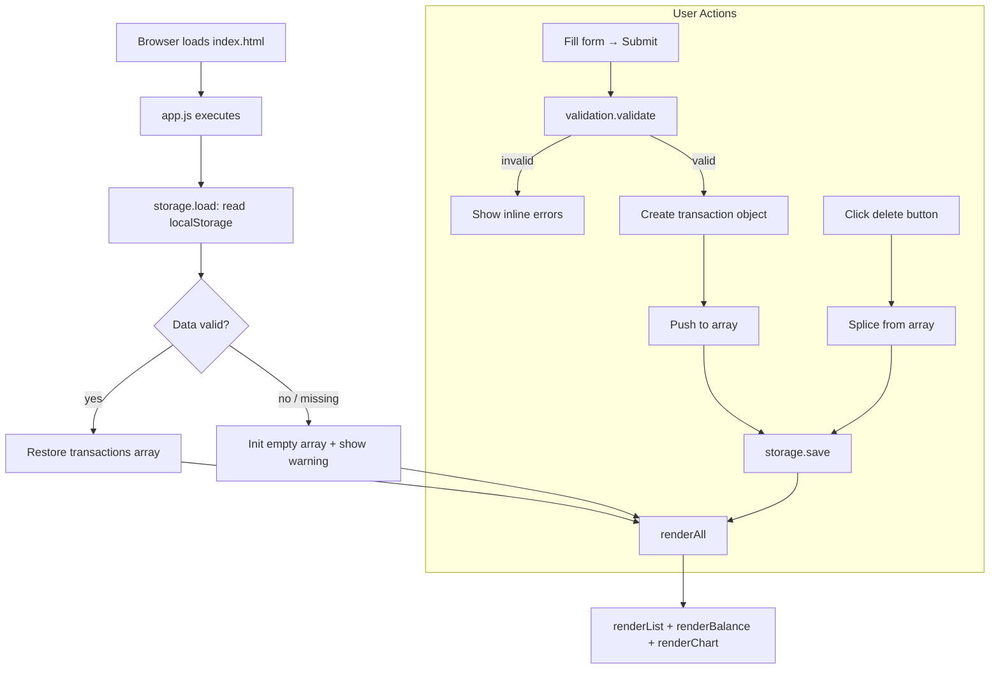

# Design Document — Expense & Budget Visualizer

## Overview

The Expense & Budget Visualizer is a zero-dependency, client-side single-page application (SPA) that lets users record personal expense transactions, review them in a scrollable list, monitor a running total balance, and understand spending distribution through a live pie chart. All data is persisted in the browser's `localStorage` so sessions survive page refreshes and browser restarts.

The entire application is delivered as three static files:

| File | Role |
|---|---|
| `index.html` | Markup, CDN link for Chart.js |
| `css/style.css` | All visual styling |
| `js/app.js` | All application logic |

No build step, no server, no login. The user opens `index.html` and the app is ready.

---

## Architecture

### High-Level Flow



### Architectural Decisions

**Single global state array** — `transactions` is a module-level array in `app.js`. Every mutation (add / delete) is immediately followed by `storage.save()` and `renderAll()`. This keeps the UI always in sync with storage without any diffing or virtual DOM.

**Full re-render on every mutation** — Given the small data set (personal expense tracking, typically < 1 000 entries), clearing and rebuilding the DOM list on each change is simpler and fast enough to stay well under the 100 ms budget.

**Chart.js singleton** — A single `Chart` instance is created on first render and updated via `chart.data` + `chart.update()` on subsequent renders, avoiding repeated canvas teardown.

**No modules** — Per project constraints, `app.js` is a plain `<script>` tag. Functions are grouped by concern using comment blocks and a consistent naming prefix.

---

## Components and Interfaces

### Function Groups in `app.js`

#### Storage Group

```
storage_load()  → Transaction[]
    Reads "transactions" key from localStorage.
    Parses JSON. Returns array or [] on failure.
    Sets a warning flag if data was malformed.

storage_save(transactions: Transaction[])  → void
    Serialises transactions to JSON.
    Writes to localStorage under key "transactions".
```

#### Validation Group

```
validation_validate(name: string, amount: string, category: string)
    → { valid: boolean, errors: { name?: string, amount?: string, category?: string } }
    
    Rules:
      name     — must be non-empty after trim
      amount   — must parse to a finite number > 0
      category — must be one of ["Food", "Transport", "Fun"]
```

#### Rendering Group

```
rendering_renderAll()  → void
    Calls renderList, renderBalance, renderChart in sequence.

rendering_renderList(transactions: Transaction[])  → void
    Clears #transaction-list.
    If empty: inserts placeholder <p>.
    Else: inserts one <li> per transaction (name, formatted amount, category, delete button).

rendering_renderBalance(transactions: Transaction[])  → void
    Sums all amounts.
    Updates #balance text content with currency-formatted total.

rendering_showFormErrors(errors: object)  → void
    Inserts inline error <span> elements next to each invalid field.

rendering_clearFormErrors()  → void
    Removes all inline error elements.
```

#### Chart Group

```
chart_init(canvas: HTMLCanvasElement)  → Chart
    Creates and returns a Chart.js pie chart instance with empty data.

chart_render(chartInstance: Chart, transactions: Transaction[])  → void
    Aggregates amounts by category.
    If all totals are zero: shows empty-state placeholder, hides canvas.
    Else: updates chartInstance.data.labels, .datasets[0].data, calls chartInstance.update().
```

### DOM Structure (index.html)

```
<body>
  <header>
    <h1>Expense & Budget Visualizer</h1>
    <div id="balance-container">
      Total: <span id="balance">$0.00</span>
    </div>
  </header>

  <main>
    <section id="form-section">
      <form id="transaction-form">
        <input  id="input-name"     type="text"   placeholder="Item name" />
        <span   id="error-name"     class="error"></span>
        <input  id="input-amount"   type="number" placeholder="Amount" min="0.01" step="0.01" />
        <span   id="error-amount"   class="error"></span>
        <select id="input-category">
          <option value="">Select category</option>
          <option value="Food">Food</option>
          <option value="Transport">Transport</option>
          <option value="Fun">Fun</option>
        </select>
        <span   id="error-category" class="error"></span>
        <button type="submit">Add Transaction</button>
      </form>
    </section>

    <section id="list-section">
      <h2>Transactions</h2>
      <ul id="transaction-list"></ul>
    </section>

    <section id="chart-section">
      <h2>Spending by Category</h2>
      <canvas id="spending-chart"></canvas>
      <p id="chart-empty-state" hidden>No transactions yet.</p>
    </section>
  </main>

  <div id="storage-warning" hidden>
    Could not load saved data. Starting fresh.
  </div>
</body>
```

### Event Wiring

| Event | Element | Handler |
|---|---|---|
| `submit` | `#transaction-form` | Validate → create transaction → add → save → renderAll |
| `click` (delete) | `#transaction-list` (delegated) | Identify transaction by `data-id` → splice → save → renderAll |
| `DOMContentLoaded` | `document` | `storage_load` → `chart_init` → `renderAll` |

Event delegation is used for delete buttons so that re-rendering the list does not require re-attaching listeners.

---

## Data Models

### Transaction Object

```js
{
  id:       string,   // crypto.randomUUID() or Date.now().toString() fallback
  name:     string,   // trimmed, non-empty
  amount:   number,   // positive finite float, stored as number not string
  category: string    // "Food" | "Transport" | "Fun"
}
```

### localStorage Schema

```
Key:   "transactions"
Value: JSON string — serialised Transaction[]

Example:
[
  { "id": "1720000000001", "name": "Coffee", "amount": 3.50, "category": "Food" },
  { "id": "1720000000002", "name": "Bus pass", "amount": 45.00, "category": "Transport" }
]
```

### Chart Data Shape (passed to Chart.js)

```js
{
  labels:   string[],  // e.g. ["Food", "Transport"]  — only non-zero categories
  datasets: [{
    data:            number[],  // sum per category, same order as labels
    backgroundColor: string[]   // fixed colour per category
  }]
}
```

### Category Colour Map

| Category | Colour |
|---|---|
| Food | `#FF6384` |
| Transport | `#36A2EB` |
| Fun | `#FFCE56` |

---

## Correctness Properties

*A property is a characteristic or behavior that should hold true across all valid executions of a system — essentially, a formal statement about what the system should do. Properties serve as the bridge between human-readable specifications and machine-verifiable correctness guarantees.*

### Property 1: Validation rejects blank or whitespace-only names

*For any* string composed entirely of whitespace characters (including the empty string), the validator SHALL reject it as an invalid name and return an error for the `name` field.

**Validates: Requirements 1.3, 1.4**

---

### Property 2: Validation rejects non-positive amounts

*For any* amount value that is zero, negative, non-numeric, or empty, the validator SHALL reject it and return an error for the `amount` field.

**Validates: Requirements 1.3, 1.4**

---

### Property 3: Validation rejects unknown categories

*For any* category string that is not exactly one of `"Food"`, `"Transport"`, or `"Fun"` (including the empty string), the validator SHALL reject it and return an error for the `category` field.

**Validates: Requirements 1.3, 1.4**

---

### Property 4: Adding a transaction grows the list by exactly one

*For any* transaction list of length N and any valid transaction, adding that transaction SHALL produce a list of length N + 1 containing the new transaction.

**Validates: Requirements 1.2, 2.1**

---

### Property 5: Deleting a transaction shrinks the list by exactly one and preserves all others

*For any* transaction list of length N ≥ 1 and any transaction T in that list, deleting T SHALL produce a list of length N − 1 that contains every original transaction except T, with all remaining transactions unchanged.

**Validates: Requirements 3.2, 3.3**

---

### Property 6: Balance equals the sum of all transaction amounts

*For any* transaction list, the computed balance SHALL equal the arithmetic sum of the `amount` field of every transaction in the list (and SHALL be zero for an empty list).

**Validates: Requirements 4.1, 4.2, 4.3, 4.4**

---

### Property 7: localStorage round-trip preserves the transaction list

*For any* transaction list, serialising it to localStorage and then deserialising it SHALL produce a list that is deeply equal to the original (same length, same field values for every entry, same order).

**Validates: Requirements 6.1, 6.2, 6.3**

---

### Property 8: Chart totals equal per-category sums

*For any* transaction list, the data values passed to the chart for each category SHALL equal the sum of `amount` across all transactions whose `category` matches that label, and only categories with a non-zero total SHALL appear as chart segments.

**Validates: Requirements 5.1, 5.4**

---

### Property 9: Amount formatting always shows two decimal places with currency symbol

*For any* positive finite number representing a transaction amount or balance, the formatted display string SHALL contain exactly two decimal places and a leading currency symbol (`$`).

**Validates: Requirements 2.1, 4.1**

---

## Error Handling

| Scenario | Detection | Response |
|---|---|---|
| Form submitted with empty name | `validation_validate` | Inline error next to name field; transaction not added |
| Form submitted with amount ≤ 0 or non-numeric | `validation_validate` | Inline error next to amount field; transaction not added |
| Form submitted with no category selected | `validation_validate` | Inline error next to category field; transaction not added |
| `localStorage` unavailable (e.g. private browsing quota exceeded) | `try/catch` in `storage_save` | Silent fail on save; in-memory state still updated; optional console warning |
| `localStorage` returns malformed JSON | `try/catch` + `JSON.parse` in `storage_load` | Initialise with empty array; show `#storage-warning` banner |
| `localStorage` returns non-array JSON | Type check after parse in `storage_load` | Same as malformed — empty array + warning |
| `crypto.randomUUID` unavailable | Feature-detect in ID generation | Fall back to `Date.now().toString() + Math.random()` |
| Chart.js CDN fails to load | `window.Chart` undefined check on init | Hide chart section; show fallback message |

---

## Testing Strategy

> **Note:** This project has no test runner configured and no test files are created. The testing strategy below describes the approach that *would* be applied if tests were added in the future.

### Unit Tests (example-based)

Focus on the pure logic functions that have no DOM or Chart.js dependency:

- **`validation_validate`** — concrete examples covering each invalid field combination, each valid combination, boundary values (amount = 0, amount = 0.01, amount = -1, whitespace-only name, unknown category string).
- **`storage_load`** — examples: valid JSON array, malformed JSON string, missing key (returns `null`), non-array JSON value.
- **Balance calculation** — examples: empty list → 0, single entry, multiple entries with decimal amounts.
- **Category aggregation** — examples: all three categories present, only one category, empty list.

### Property-Based Tests

The Correctness Properties section above identifies nine universal properties. If a property-based testing library were added (e.g., `fast-check` for JavaScript), each property would map to one test:

| Property | Test pattern |
|---|---|
| 1 — Validator rejects whitespace names | Generate arbitrary whitespace strings; assert `valid === false` |
| 2 — Validator rejects non-positive amounts | Generate zero, negative numbers, NaN strings; assert `valid === false` |
| 3 — Validator rejects unknown categories | Generate arbitrary strings not in the allowed set; assert `valid === false` |
| 4 — Add grows list by 1 | Generate list + valid transaction; assert `length === N + 1` and item present |
| 5 — Delete shrinks list, preserves others | Generate list of length ≥ 1; pick random index; assert length and contents |
| 6 — Balance equals sum | Generate arbitrary transaction lists; assert `balance === sum(amounts)` |
| 7 — localStorage round-trip | Generate arbitrary transaction lists; serialise → deserialise; assert deep equality |
| 8 — Chart totals equal category sums | Generate arbitrary transaction lists; assert chart data matches per-category sums |
| 9 — Amount formatting | Generate arbitrary positive numbers; assert two decimal places and `$` prefix |

### Integration / Smoke Tests

- On page load with pre-seeded localStorage, all three UI regions (list, balance, chart) render the correct data.
- Adding a transaction via the form updates all three regions without a page reload.
- Deleting a transaction via the delete button updates all three regions without a page reload.
- Submitting the form with invalid data shows inline errors and does not mutate the list.
- Clearing localStorage and reloading shows the empty-state placeholder and zero balance.

### Responsiveness

Manual verification at 320 px, 768 px, 1280 px, and 1920 px viewport widths to confirm no horizontal scroll and no overlapping elements.
